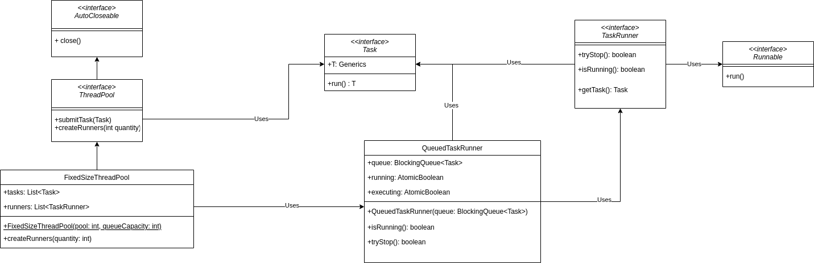

## framework.tasks.Task Scheduling Framework

### This is a framework designed to schedule and execute tasks with a fixed Thread Pool.

## UML Diagram



## Usage

1. You need to define a size for your Thread Pool, and a maximum queue capacity (maximum number of tasks enqueued).
IE: `framework.pool.ThreadPool threadPool = new framework.pool.FixedSizeThreadPool(3, 2000)`. For now, FixedThreadPool is the only implementation,
but in the future there may be alternatives like an auto resizing framework pool. This must be done using try-with-resources, since the framework.pool.ThreadPool implements the AutoCloseable interface.
Example:
```java
        try(framework.pool.ThreadPool threadPool = new framework.pool.FixedSizeThreadPool(3, 2000)) {
            // Your code here, tipically submission of tasks as detailed below.  
        } 
```
2. You need to submit tasks for your Thread Pool. This can be done either via lambda, using anonymous
classes:
```java
threadPool.submitTask(() -> {
    System.out.println("Starting task");
    Thread.sleep(1000l);
    System.out.println("Ending task");
    return UUID.randomUUID();
});
```
Or in a more traditional manner, with classes implementing the framework.tasks.Task interface:

```java
import framework.tasks.Task;

public class framework.tasks.HelloWorldTask implements Task<String> {
    @Override
    public String run() throws InterruptedException {
        return "Hello World";
    }
}

//...

threadPool.submitTask(new framework.tasks.HelloWorldTask());

```
3. After all submitted tasks have been concluded, your framework.pool.ThreadPool will automatically be deleted, along with all it's threads.
